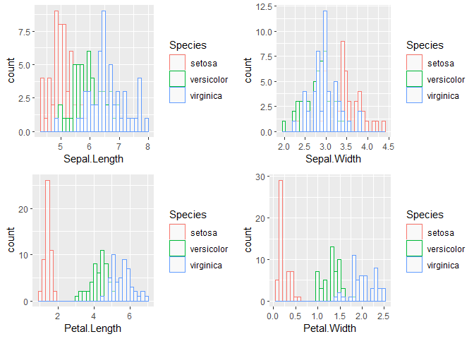
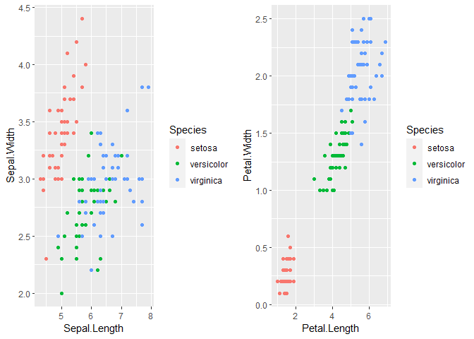
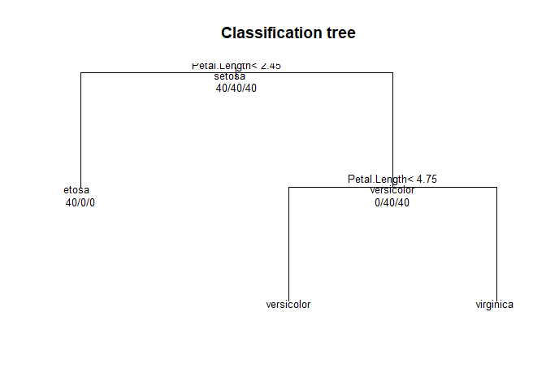

Load the neccesary libraries

    library(ggplot2)
    library(ggpubr)
    library(dplyr)
    library(caret)
    library(randomForest)

### Iris dataset

    str(iris)

    ## 'data.frame':    150 obs. of  5 variables:
    ##  $ Sepal.Length: num  5.1 4.9 4.7 4.6 5 5.4 4.6 5 4.4 4.9 ...
    ##  $ Sepal.Width : num  3.5 3 3.2 3.1 3.6 3.9 3.4 3.4 2.9 3.1 ...
    ##  $ Petal.Length: num  1.4 1.4 1.3 1.5 1.4 1.7 1.4 1.5 1.4 1.5 ...
    ##  $ Petal.Width : num  0.2 0.2 0.2 0.2 0.2 0.4 0.3 0.2 0.2 0.1 ...
    ##  $ Species     : Factor w/ 3 levels "setosa","versicolor",..: 1 1 1 1 1 1 1 1 1 1 ...

    head(iris)

    ##   Sepal.Length Sepal.Width Petal.Length Petal.Width Species
    ## 1          5.1         3.5          1.4         0.2  setosa
    ## 2          4.9         3.0          1.4         0.2  setosa
    ## 3          4.7         3.2          1.3         0.2  setosa
    ## 4          4.6         3.1          1.5         0.2  setosa
    ## 5          5.0         3.6          1.4         0.2  setosa
    ## 6          5.4         3.9          1.7         0.4  setosa

There are 50 observations from each of iris species type sentosa,
versicolor, and virginica. Lets explore the data set further.

Exploratory data analysis
-------------------------

Mean, max and min values of the petal properties of each flower species
type are computed as follows:

    summary(iris[1:4])

    ##   Sepal.Length    Sepal.Width     Petal.Length    Petal.Width   
    ##  Min.   :4.300   Min.   :2.000   Min.   :1.000   Min.   :0.100  
    ##  1st Qu.:5.100   1st Qu.:2.800   1st Qu.:1.600   1st Qu.:0.300  
    ##  Median :5.800   Median :3.000   Median :4.350   Median :1.300  
    ##  Mean   :5.843   Mean   :3.057   Mean   :3.758   Mean   :1.199  
    ##  3rd Qu.:6.400   3rd Qu.:3.300   3rd Qu.:5.100   3rd Qu.:1.800  
    ##  Max.   :7.900   Max.   :4.400   Max.   :6.900   Max.   :2.500

    g1_1 <- ggplot(iris, aes(x = Sepal.Length, color = Species)) + geom_histogram(fill = "white", alpha = 0.5, position = "identity")

    g1_2 <- ggplot(iris, aes(x = Sepal.Width, color = Species)) + geom_histogram(fill = "white", alpha = 0.5, position = "identity")

    g1_3 <- ggplot(iris, aes(x = Petal.Length, color = Species)) + geom_histogram(fill = "white", alpha = 0.5, position = "identity")

    g1_4 <- ggplot(iris, aes(x = Petal.Width, color = Species)) + geom_histogram(fill = "white", alpha = 0.5, position = "identity")

    figure <- ggarrange(g1_1, g1_2, g1_3, g1_4, ncol = 2, nrow = 2)

    ## `stat_bin()` using `bins = 30`. Pick better value with `binwidth`.
    ## `stat_bin()` using `bins = 30`. Pick better value with `binwidth`.
    ## `stat_bin()` using `bins = 30`. Pick better value with `binwidth`.
    ## `stat_bin()` using `bins = 30`. Pick better value with `binwidth`.

    figure

    g2 <- ggplot(iris, aes(x = Sepal.Length, y = Sepal.Width, color = Species)) + geom_point()

    g3 <- ggplot(iris, aes(x = Petal.Length, y = Petal.Width, color = Species)) + geom_point()

    figure2 <- ggarrange(g2, g3, ncol = 2, nrow = 1)
    figure2

From the histogram plots and the length vs width plot for sepal and
petal, a trend can be observed, which can be used for identifying
different species of iris flower. Foriinstance Virginia seens to have
greater petal width and length compared to versicolor and sentosa
species.

    cor(iris$Sepal.Length, iris$Sepal.Width)

    ## [1] -0.1175698

    cor(iris$Petal.Length, iris$Petal.Width)

    ## [1] 0.9628654

Petal lenght and petal width have a high corelation value of 0.96. Now
that we have performed some exploratory data analysis, lets fit a model
for classifying differnt species of iris.

### Classification of iris species

First step is splitting the data set into test and train data. For this
we use a split ratio of 0.8.

    set.seed(1234)
    trainIndex <- createDataPartition(iris$Species, p = 0.8, list = F, times = 1)
    train_iris <- iris[trainIndex, ]  # train dataset
    test_iris <- iris[-trainIndex, ]  # test dataset

KNN, random forest and decision trees model have been built using caret
package on iris dataset. The accuracy on predicted test data is also
reported.

    # train control
    control <- trainControl(method='repeatedcv', number = 10, repeats = 3, search = 'grid')

    # decision trees
    model_decision <- train(Species~., data = train_iris, method = 'rpart', trControl = control)
    predict_dt <- predict(model_decision, test_iris)
    confusionMatrix(predict_dt, test_iris$Species)

    ## Confusion Matrix and Statistics
    ## 
    ##             Reference
    ## Prediction   setosa versicolor virginica
    ##   setosa         10          0         0
    ##   versicolor      0          8         1
    ##   virginica       0          2         9
    ## 
    ## Overall Statistics
    ##                                           
    ##                Accuracy : 0.9             
    ##                  95% CI : (0.7347, 0.9789)
    ##     No Information Rate : 0.3333          
    ##     P-Value [Acc > NIR] : 1.665e-10       
    ##                                           
    ##                   Kappa : 0.85            
    ##                                           
    ##  Mcnemar's Test P-Value : NA              
    ## 
    ## Statistics by Class:
    ## 
    ##                      Class: setosa Class: versicolor Class: virginica
    ## Sensitivity                 1.0000            0.8000           0.9000
    ## Specificity                 1.0000            0.9500           0.9000
    ## Pos Pred Value              1.0000            0.8889           0.8182
    ## Neg Pred Value              1.0000            0.9048           0.9474
    ## Prevalence                  0.3333            0.3333           0.3333
    ## Detection Rate              0.3333            0.2667           0.3000
    ## Detection Prevalence        0.3333            0.3000           0.3667
    ## Balanced Accuracy           1.0000            0.8750           0.9000

    # view trees
    plot(model_decision$finalModel, uniform = T, main = 'Classification tree')
    text(model_decision$finalModel, use.n = T, all = T, cex = 0.8)

    # random forest
    modelrf <- randomForest(Species~., data = train_iris, trControl = control)
    predict_rf <- predict(modelrf, test_iris)
    confusionMatrix(predict_rf, test_iris$Species)

    ## Confusion Matrix and Statistics
    ## 
    ##             Reference
    ## Prediction   setosa versicolor virginica
    ##   setosa         10          0         0
    ##   versicolor      0         10         2
    ##   virginica       0          0         8
    ## 
    ## Overall Statistics
    ##                                           
    ##                Accuracy : 0.9333          
    ##                  95% CI : (0.7793, 0.9918)
    ##     No Information Rate : 0.3333          
    ##     P-Value [Acc > NIR] : 8.747e-12       
    ##                                           
    ##                   Kappa : 0.9             
    ##                                           
    ##  Mcnemar's Test P-Value : NA              
    ## 
    ## Statistics by Class:
    ## 
    ##                      Class: setosa Class: versicolor Class: virginica
    ## Sensitivity                 1.0000            1.0000           0.8000
    ## Specificity                 1.0000            0.9000           1.0000
    ## Pos Pred Value              1.0000            0.8333           1.0000
    ## Neg Pred Value              1.0000            1.0000           0.9091
    ## Prevalence                  0.3333            0.3333           0.3333
    ## Detection Rate              0.3333            0.3333           0.2667
    ## Detection Prevalence        0.3333            0.4000           0.2667
    ## Balanced Accuracy           1.0000            0.9500           0.9000

    # KNN
    model_knn <- train(Species ~., data = train_iris, method = 'knn', trControl = control)
    predict_knn <- predict(model_knn, test_iris)
    confusionMatrix(predict_knn, test_iris$Species)

    ## Confusion Matrix and Statistics
    ## 
    ##             Reference
    ## Prediction   setosa versicolor virginica
    ##   setosa         10          0         0
    ##   versicolor      0          9         1
    ##   virginica       0          1         9
    ## 
    ## Overall Statistics
    ##                                           
    ##                Accuracy : 0.9333          
    ##                  95% CI : (0.7793, 0.9918)
    ##     No Information Rate : 0.3333          
    ##     P-Value [Acc > NIR] : 8.747e-12       
    ##                                           
    ##                   Kappa : 0.9             
    ##                                           
    ##  Mcnemar's Test P-Value : NA              
    ## 
    ## Statistics by Class:
    ## 
    ##                      Class: setosa Class: versicolor Class: virginica
    ## Sensitivity                 1.0000            0.9000           0.9000
    ## Specificity                 1.0000            0.9500           0.9500
    ## Pos Pred Value              1.0000            0.9000           0.9000
    ## Neg Pred Value              1.0000            0.9500           0.9500
    ## Prevalence                  0.3333            0.3333           0.3333
    ## Detection Rate              0.3333            0.3000           0.3000
    ## Detection Prevalence        0.3333            0.3333           0.3333
    ## Balanced Accuracy           1.0000            0.9250           0.9250

    # best tuning parameter 'k'
    model_knn$bestTune

    ##   k
    ## 3 9
